## 2025  

- **Just concluded EI 2025 Proceedings**: Embodied Intelligence (EI) Conference 2025 was a highlight for me, as I co-chaired the event with my supervisor, Prof. Fumiya Iida. The online format brought together speakers and scientists from diverse fields to explore EI collectively, and following the discussions we opened a call for papers that concluded in December 2025. I’m looking forward to the conversations emerging from the proceedings.

- **Published my first book**: Together with Prof. Fumiya Iida, I co-authored "Foundations of Embodied Intelligence for Robotic Systems", a text book for newcomers in the field of robotics. [[Full Text]](https://www.researchgate.net/publication/397764549_Foundations_of_Embodied_Intelligence_for_Robotic_Systems) [[Online Publication]](https://www.emerald.com/ftrob/article-abstract/12/4/350/1335132/Foundations-of-embodied-intelligence-for-robotic?redirectedFrom=fulltext)

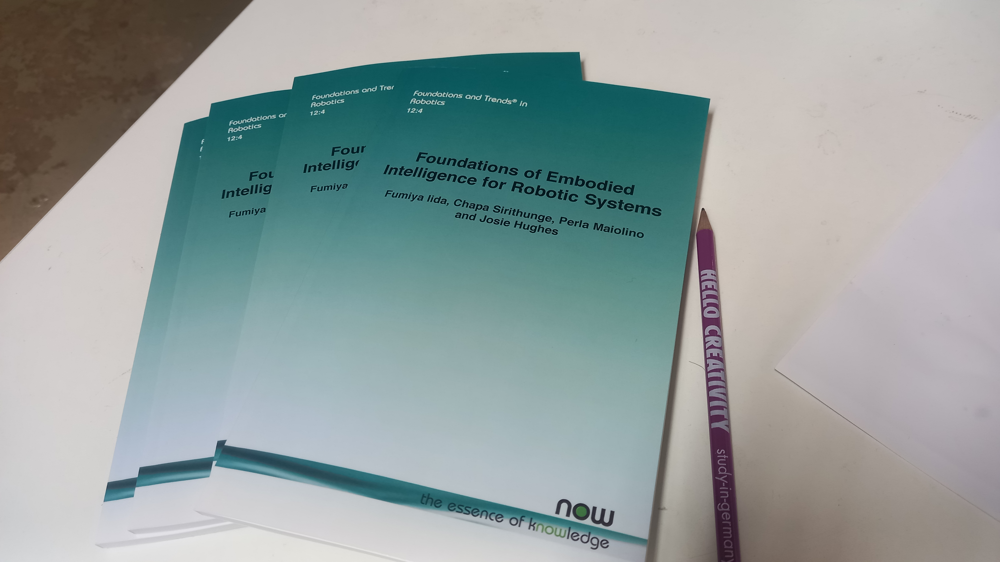

- **Another event with Women in robotics Cambridge**: After a year since establishment, we, women in robotics Cambridge, wrapped up our very first casual Chat about Robotics event. It brought together robotics enthusiasts and researchers across three robotics labs across Cambridge: Bio-Inspired Robotics Lab, Control Robotics Group and Affective Intelligence and Robotics Lab to connect and share ideas.

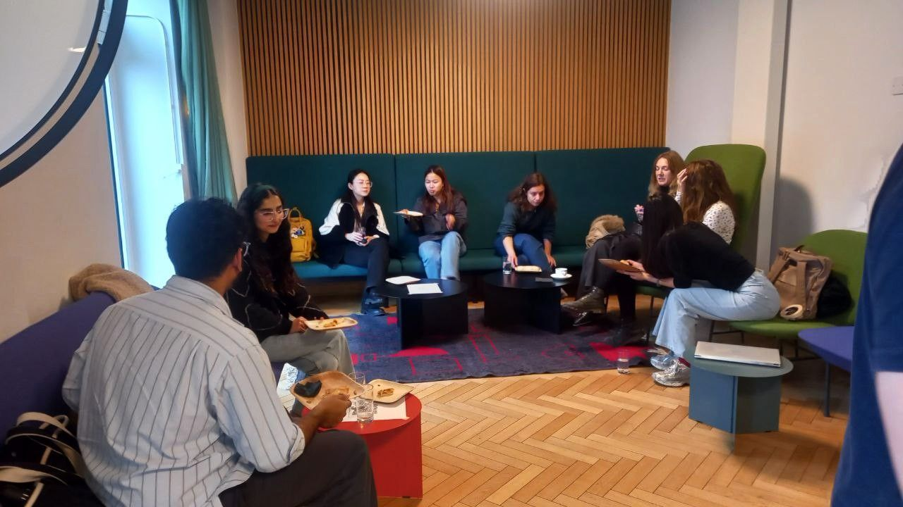

- **Fun evening playing chess with college members at Newnham College**: My colleague Liuba Dvinskikh organised a casual chess session with college members. I hadn’t played in about 14 years, so it was refreshing to return to the board—relaxing, engaging, and full of good company.

 
- **Robots showcase at Cambridge festival**: Cambridge women in robotics organised robots showcase event with the Cambridge festival on the 29th of March. This event was intended for general public, especially kids from age 10 upwards. Had a fun afternoon on 27.02.2025 at BBC Radio Cambridgeshire promoting this event coming up at the Cambridge Festival. I spoke to presenter Louise Holland about our motivations with this event, robot building and women in robotics Cambridge. 

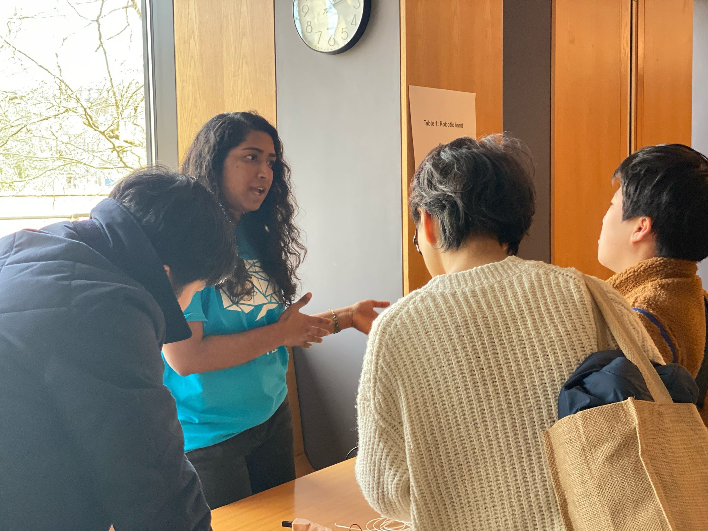

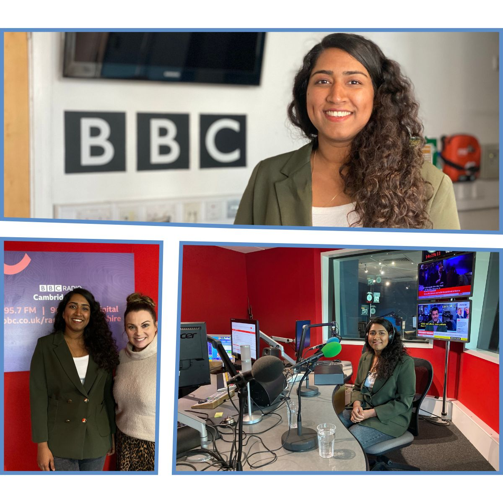

  
- **Talk at CUED BioEngineering Conference 2025**: I had the opportunity to present my work on "Synthetic Generation of Pain Expressions for Robopatients" at the Cambridge University Bioengineering Conference on Friday, 21 March 2025, held at St. Catherine’s College. It was my first time speaking to an audience comprised entirely of biology experts—an exciting shift in perspective. I hope the talk sparked some interesting cross-disciplinary discussions. It's always fascinating to see how robots still evoke more fear than familiarity for some! More details [here](https://www.eng.cam.ac.uk/research/academic-divisions/mechanics-materials-and-design/events).
    
- **Teaching in Cambridge**: This marks my third year teaching at the University of Cambridge. So far, I have delivered lectures on Soft Robotics, Human-Robot Interaction, and Machine Learning for Robotic Control. My teaching journey began during my second year as a PhD candidate at the University of Moratuwa. The experience gained, combined with the outcomes of my PhD, led to my appointment as a lecturer in Mechatronics at Sri Lanka Technological Campus, just eight months after my defense in December 2020. Through this journey, I have gained valuable insights into teaching methodologies, from preparing lecture materials to effectively engaging with students across a wide age range, from young undergraduates to professionals nearing retirement.

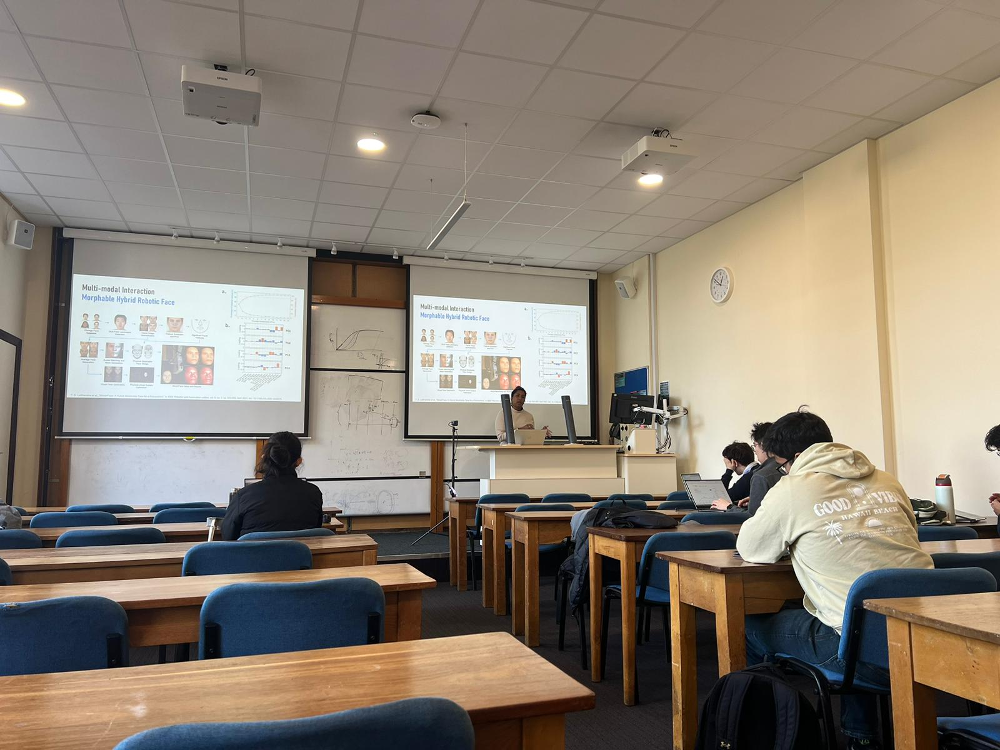

- **Robotics and Embodied Intelligence Workshop**: I organised the robotics and embodied intelligence workshop with the sponsorship of the Centre for Human-Inspired AI (CHIA) Cambrigde. This is the first sponsored event from Cambridge Women-in-Robotics. Full program can be found [here](https://www.chia.cam.ac.uk/events/women-in-robotics)

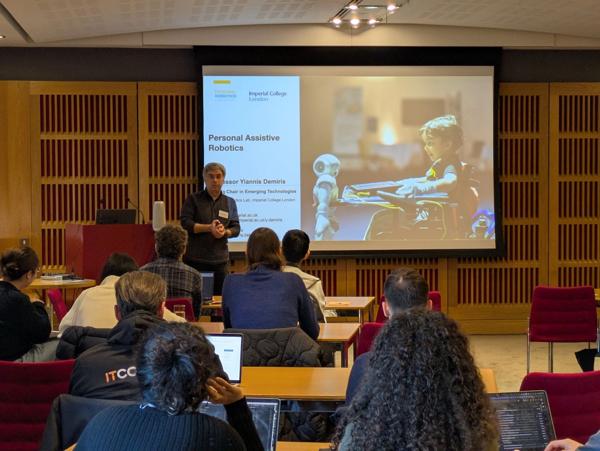

- **Co-chairing Embodied Intelligence online conference 2025**: This year marks the 5th time Prof. Fumiya Iida with the Bio-Inspired Robotics Lab is organising the online conference for discussing the past, present and future of embodied intelligence research. The conference will be held online 2-4 April 2025. Full program and registration can be found [here](https://embodied-intelligence.org/)

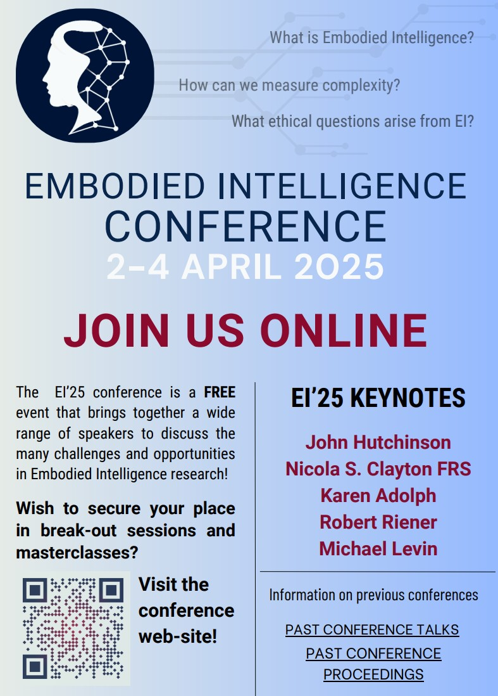

##2024

- **Presented at Digital Roads of the Future Annual Review 2024**: Presented a poster on my research on "Multi-Agent Systems on Machine Safety in Complex Environments". The event was held at Cambridge Union Society on the 13th November. The event hosted all the PIs, academic supervisors, industry partners, research fellows of the Digital Roads of Future program and potential investors. [Details](https://www.linkedin.com/posts/digital-roads-of-the-future-drf_msca-digitalroads-innovation-activity-7262870274646134786-lS8x?utm_source=share&utm_medium=member_desktop)

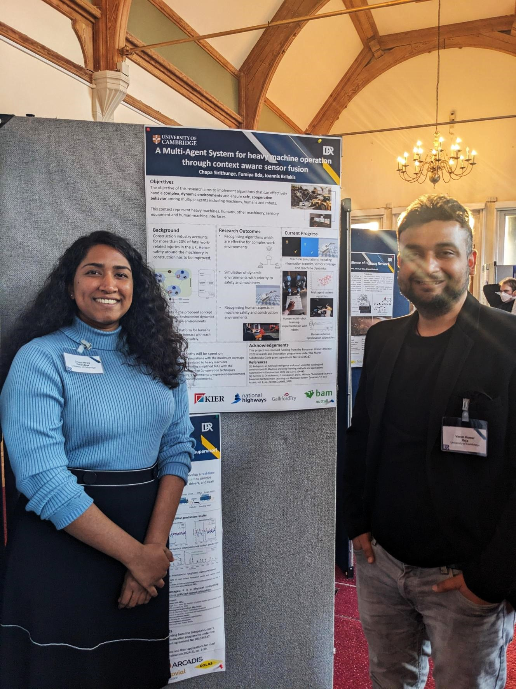

- **Talk on robotics**: Excited to share that gave a talk titled "Navigating the Physical World: The Essential Role of Robots" at  the kick off **pudding seminar** of Michaelmas term at Newnham College, Cambridge on the 11th of **October**. [Details](https://newn.cam.ac.uk/newnham-news/how-earthworms-and-plants-inspire-scientists-creating-robots)

- **Robotics Workshop**:  I conducted the "Enhancing Women's Participation in Robotics" workshop and showcased robots with my team at the GLOBALWIIN 2024 Conference on the 3rd of **October** 2024. I'm proud to share that this marks our second event since founding the Women-in-Robotics Support Network for female roboticists.

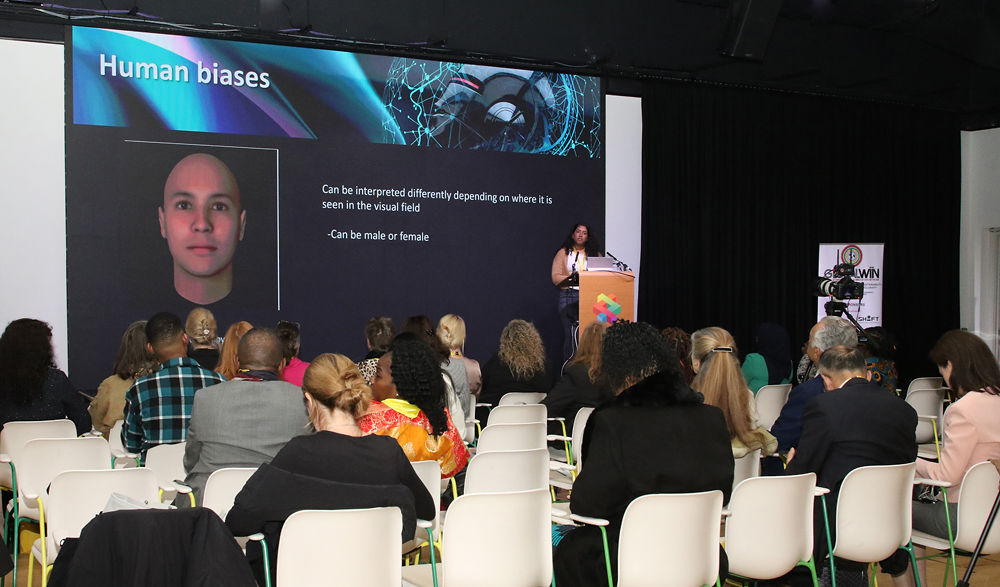

- **Award during postdoc appreciation week**: It was fascinating to be selected as a winner of the "Heroines of Science" award. This recognition is an incredible opportunity to share my journey through life and science, and I hope to inspire the next generation of young minds. [Find more](https://www.postdocacademy.cam.ac.uk/news/heroines-science-winners)

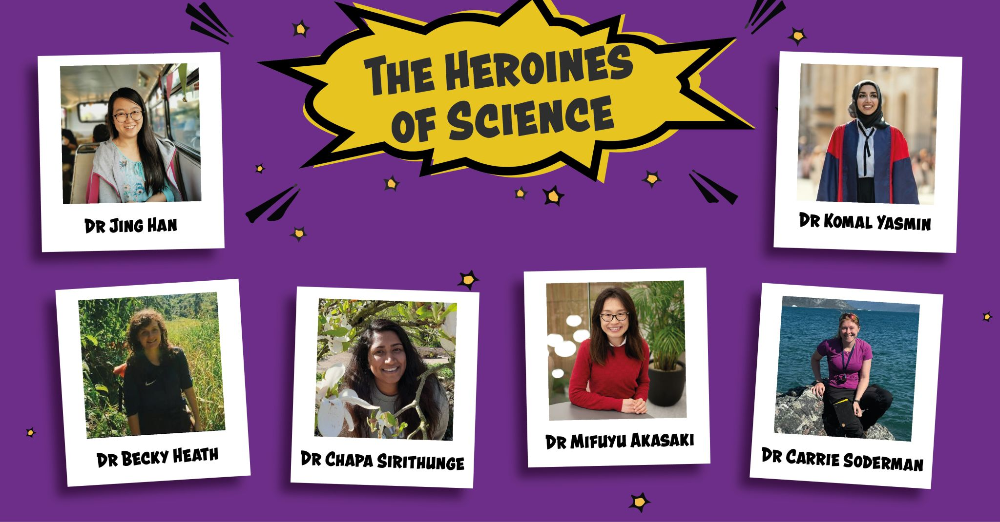

- **Robotics Workshop**: I conducted the "Women-in-Robotics" workshop at the AgriForwards CDT Conference 2024 on October 22nd, attracting over 25 participants, including male and female engineers and academic staff. It was fascinating to see recent statistics showing that men support this approach more than ever before in history.

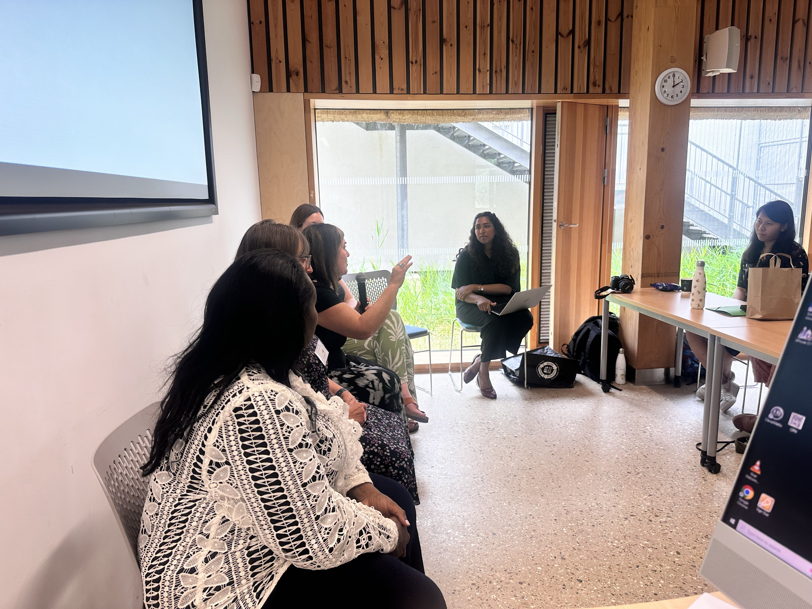

- **Women-in-robotics**: With the growing number of female researchers and staff at the University of Cambridge, I am delighted to announce that we have established the Women-in-Robotics Support Network, and I am honored to lead the team. If you're interested in our activities or curious to support, sign up [here](https://forms.office.com/e/aTcDGvujNu)
  
- **Lecture in Technical Training**: I gave an introductory talk on Soft Robotics for the new colleagues joing Future Roads program under Automation & Robotics theme for MSCA Cohort 3 Fellows and Industry partners.

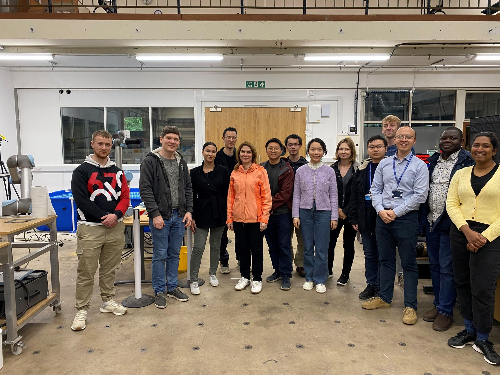

- **Live Morning Show Interview on Sirasa TV (Sinhalese)**: This interview was aimed at aspiring researchers and general public. During the interview I shared my life story, career as a scientist, my approach for research and the importance of asking fundamental questions.
[Watch on Youtube](https://www.youtube.com/watch?v=3APExJYP98Q&t=621s&pp=ygUQY2hhcGEgc2lyaXRodW5nZQ%3D%3D)

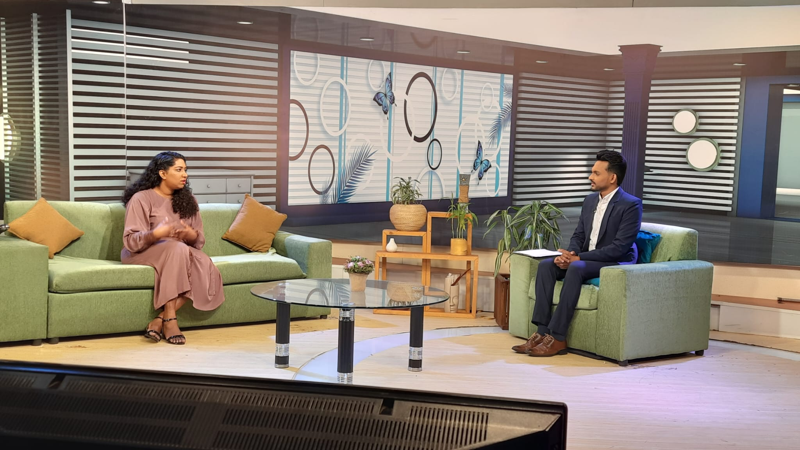

- **Taking part in policy event**: It was an amazing opportunity to learn the intersection between Science and policy at EuroScience Open Forum 2024 – MSCA Satellite Event. This was held in Katowice, Poland from June 10-11, 2024, this event brought together the MSCA research community to discuss the European research landscape.

- **Celebrating anniversary**: It was a wonderful and memorable celebration marking Prof. Fumiya Iida's 10th anniversary at the University of Cambridge, complete with cake and great company!

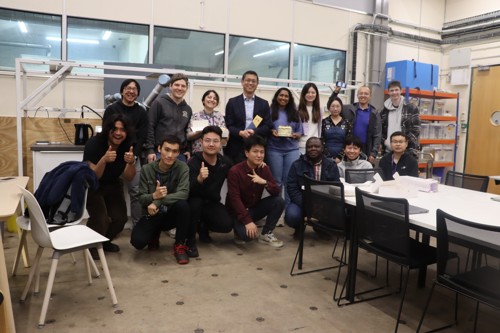

- **Future Intelligence Talk Series**: Together with my colleagues, I organise this online talk series to enhance the visibility of excellent early career researchers and disseminate state-of-the-art research work in future intelligence to enthusiasts. [Find next speaker here](https://fitalk.github.io/)
[Listen to previous talks](https://www.youtube.com/channel/UCpq_uwlsTB7fzf3CV0ctGpQ)
  
- **Science fair**: It was an incredible experience from the recent "Science is Wonderful" Science Fair organized by the Marie Curie Fund-European Union, held at Egg-Brussels. I had the fantastic opportunity to introduce young minds to the cutting-edge world of robotics through my booth, "RoboPilot Adventures". [Youtube](https://www.youtube.com/watch?v=8qk-LaSWLrU&ab_channel=BranchEducation)

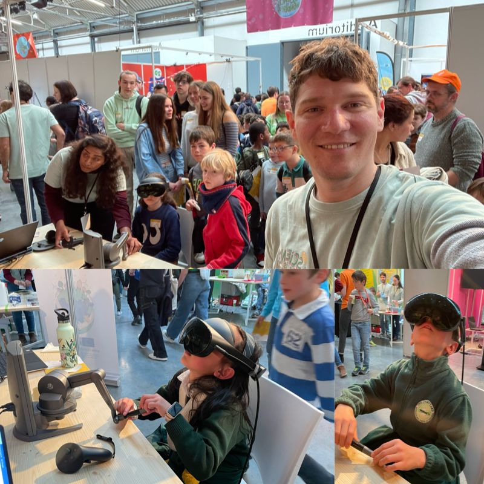

- **Newspaper article**: I enjoyed literature, calligraphy and writing from my childhood. I wrote my first newspaper article to Vidusara, the weekly Science magazine in Sri Lanka, on "Robotics for the changing world". This was written in Sinhalese and published in 2017 while I was in my 1st year as a PhD candidate.

---

