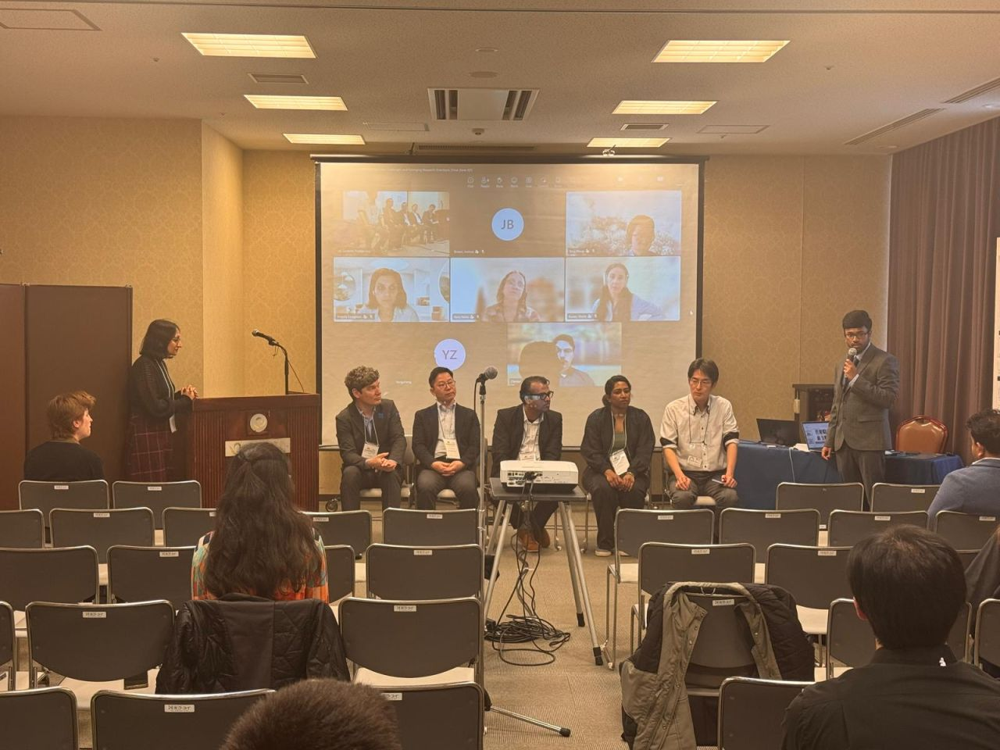
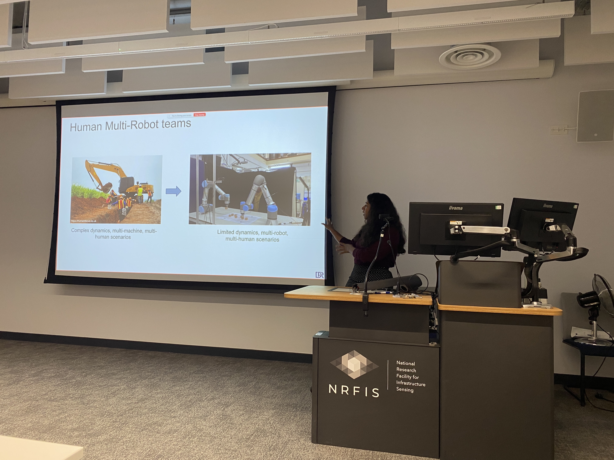

# 2026

09.2026     
*Robotic Proxies for Understanding Human Communicative Design*        
Microrobotics and Biomedical Robotics Labs, University of Sheffield

07.2026     
*Robots as experimetal models of human*        
Mathematics of Human Behaviour: A multidisciplinary School, Isaac Newton Institute     

06.2026     
*Insights from human-robot interaction for embodied arial systems*      
HKUST, NUS, Bristol workshop on arial robotics research, University of Bristol

05.2026     
*How to conduct fundamental research? Insights from robotics and AI*        
Research Lounge, Faculty of Graduate Studies, University of Moratuwa        

04.2026     
*Soft Robotic Surrogates for Understanding Human Anatomical and Communicative Design*       
Kento Kawaharazuka Lab, University of Tokyo     

04.2026     
*Robotic Proxies for Understanding Human Design*        
Bio-Inspired Robotics Lab, University of Tokyo      

04.2026  
*Politics of softness- Who controls touch, force and perception?*  
"Understanding Soft-Matter Stiffness: Key Challenges and Emerging Research Directions" Workshop, RoboSoft 2026, Kanazawa, Japan

<!--  -->

03.2026         
*Robotic Proxies for Understanding Human Design*        
CREATE Lab, EPFL        

01.2026      
*Robotics for Safe Human-Machine Interaction*       
Digital Roads of the Future Lunch time seminar, Department of Civil Engineering, University of Cambridge

<!--  -->

## 2025

11.2025   
*Robot anatomy and design*  
Robot Talk Podcast 
[Listen on YouTube](https://www.youtube.com/watch?v=Nn8j9Y3boIM)

11.2025     
*Robotics for Human-Machine Safety*     
A47 Site Visit, Galliford Try

10.2025  
*Robotic Proxies to Understand Human Design*      
Division-F Conference, University of Cambridge

10.2025  
*Medical Robotic Simulators for the Generation of Pain Expressions*   
Department of Psychology, University of Cambridge

07.2025  
*Robotics for Built Environment*     
Construction Engineering Masters Program, Institute of Manufacturing (IfM), University of Cambridge.

06.2025  
*Future Trends in Robotics and Industry 4.0*    
Robotics and Industry 4.0 Workshop Series organised by IEEE Young to Niche Professionals (Y2NPro) Sri Lanka.

04.2025  
*Bio-Inspired Designs and Tactile Systems for Soft Robotic Manipulation*   
Emerging Paradigms in Soft Manipulation: from the lab to the real world Workshop at RoboSoft 2025.

03.2025  
*Adaptive Pain Generation in Robopatients*    
Cambridge University Engineering Department (CUED) BioEngineering Conference.

03.2025  
*The Role of Robots in our Society*    
Robot showcase event at Cambridge Festival, accompanied by an interview with Louise Holland on BBC Radio Cambridgeshire on 27.02.2025.

## 2024

10.2024  
*Navigating the Physical World: The Essential Role of Robots*   
Newnham College, Cambridge.

09.2024  
*Encouraging women’s participation in robotics*   
Talk and robot showcase at GLOBALWIIN 2024 conference.

05.2024  
*Evolutionary Soft Robotics*    
Robotics and Automation workshop organised by Digital Roads of the Future Project, University of Cambridge.

03.2024  
*Interview with Buddhika Ekanayake for “Jeewithayata Idadenna”*    
Live morning program on Sirasa TV in Sinhalese on becoming a successful researcher and pathways for researchers in engineering, Interviewed and broadcasted on 07.03.2024. 
[Listen on YouTube](https://www.youtube.com/watch?v=3APExJYP98Q)

01.2024  
*Short talk on “Robotic patients”*    
Clinical AI interest group, Alan Turing Institute.

## 2023

06.2023  
*Machine Learning for Soft Robotic Simulations*    
“Towards an accessible soft robotics toolbox and validation test rig” workshop at ICRA 2023.

