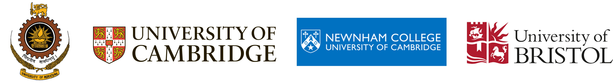

# Robotics Researcher

I am an assistant professor in robotics at University of Bristol. 

My research investigates the role of embodiment in robotic intelligence. I combine robotic design, multimodal sensing, and adaptive control to understand how physical structure influences perception, interaction, and autonomy. My goal is to develop robotic systems that can operate robustly in complex environments, from human-centered settings to challenging field applications.

I’m passionate about advancing robotics through innovative research, impactful projects, and engaging outreach. If any of these topics resonate with you—whether you’re interested in collaborating, learning more about my work, or simply discussing the future of robotics—I’d love to connect.

If you’re currently exploring PhD opportunities in areas like robot design, assistive computing or human–robot interaction, feel free to reach out with your CV!

**Email**: [chapa.sirithunge@bristol.ac.uk](mailto:chapa.sirithunge@bristol.ac.uk)  

 [Google Scholar](https://scholar.google.com/citations?user=72CpRjoAAAAJ&hl=en)

 [LinkedIn](https://www.linkedin.com/in/chapa-sirithunge-b932719a/)   
 

