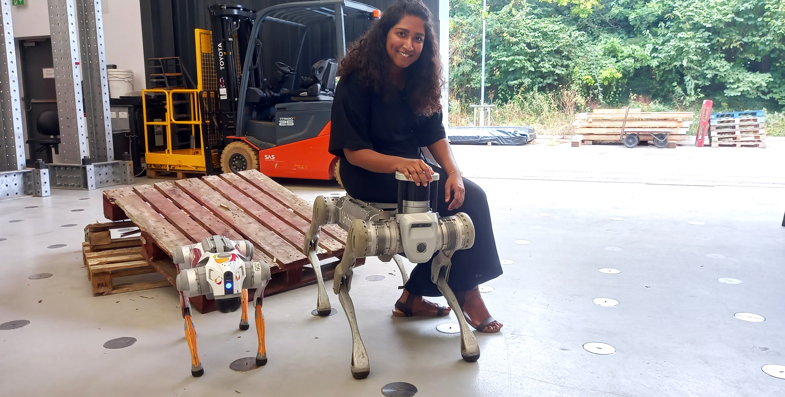
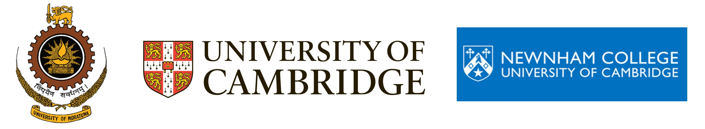

# Robotics Researcher

I am a Marie-Curie **postdoctoral fellow** specialising in **robotics** with a passion for **service robots  and human-centred design**. Currently based at **University of Cambridge**, I work on projects that integrate **multimodal sensing, morphological design of robots and embodied intelligence**, aiming to **develop robots which can serve a wider range of applications**.

I’m passionate about advancing robotics through innovative research, impactful projects, and engaging outreach. If any of these topics resonate with you—whether you’re interested in collaborating, learning more about my work, or simply discussing the future of robotics—I’d love to connect.

I’ll be joining the University of Bristol as an Assistant Professor in Robotics. If you’re currently exploring PhD opportunities in areas like assistive computing or human–robot interaction, feel free to reach out with your CV!

**Email**: [csh66@cam.ac.uk](mailto:csh66@cam.ac.uk)  

 [Google Scholar](https://scholar.google.com/citations?user=72CpRjoAAAAJ&hl=en)

 [LinkedIn](https://www.linkedin.com/in/chapa-sirithunge-b932719a/)   
 

