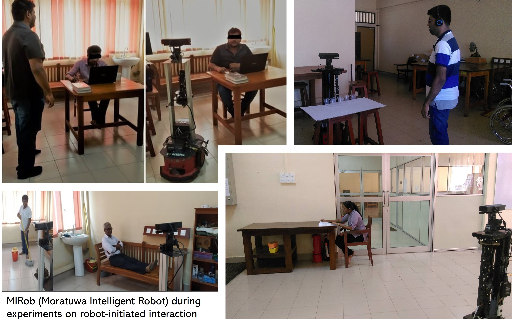

I started my PhD in 2016 with Prof. **Buddhika Jayasekara** in the **Intelligent Service Robotics Group**. This was when service robotics began gaining momentum in Sri Lanka, and the group grew steadily as new members joined. It was a turning point in my life: as one of the first members, I had the rare opportunity to help build the lab from the ground up. 

???+ "Selected papers"
    Enhancing Overall Object Placement by Understanding Uncertain Spatial and Qualitative Distance Information in User Commands - [*ICRA*, 2018](https://ieeexplore.ieee.org/abstract/document/8460624)  
    Situation Awareness for Proactive Robots in HRI - [*IROS*, 2019](https://ieeexplore.ieee.org/abstract/document/8967821)  
    Recognition of arm and body postures as social cues for proactive HRI - [*Paladyn Journal of Behavioural Robotics*, 2021](https://www.degruyterbrill.com/document/doi/10.1515/pjbr-2021-0030/html)  
    Proactive Robots With the Perception of Nonverbal Human Behavior: A Review - [*IEEE ACCESS*, 2019](https://ieeexplore.ieee.org/abstract/document/8734064/)  
  
One highlight was running human studies, surveys, and Wizard-of-Oz experiments. A key finding was around what people actually prefer when it comes to how robots look and behave — particularly their perceptual cues. It was also really interesting to see how open the local community was to having robots around for assistance (this research was done in Sri Lanka at the time).

Illustrations from the [work](https://iopscience.iop.org/article/10.1088/1757-899X/1292/1/012014/meta) which outlines the flexibility of participants' preferences on robots look but all of them have eyes as perceptual cues.

