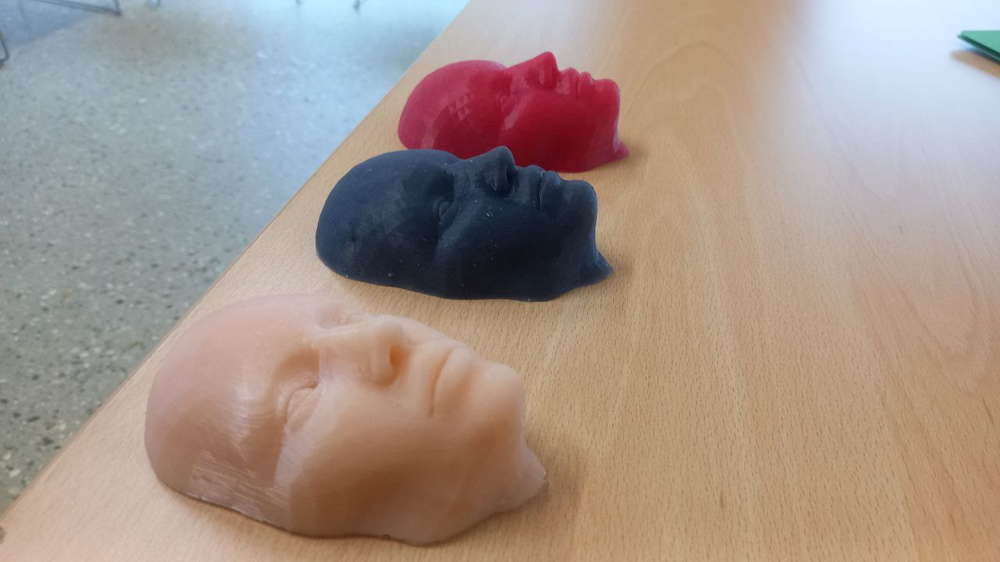

## Soft Manipulation

The exceptional dexterity, adaptability, and sensory feedback of human and primate hands serve as a gold standard for developing soft robotic hands, inspiring designs that aim to replicate nuanced movements, grip versatility, and tactile precision for complex tasks.

Soft Robotics often lack datasets unlike rigid robots. We developed wearable soft robots that can extract human data related to fine manipulation for training robotic manipulators.

Humans exploit material softness through passive skin mechanics and refined proprioception. I explored these human strategies for soft-matter interaction and how they can be replicated in robotic hands.

<video controls width="600">
  <source src="../../assets/images/finger.mp4" type="video/mp4">
</video>

???+  "Read related work here"
    [Effect of Material Viscosity on Tactile Compliance Discrimination](https://ieeexplore.ieee.org/abstract/document/10719786)   
    [A Study on Pressure Modulation for Biomimetic Fine Manipulation for Soft Robots](https://ieeexplore.ieee.org/abstract/document/10522017)

Ancient primates such as gorillas and aye-ayes evolved hand designs specialised for specific tasks. We explored whether a general, customisable hand could be developed to study the capabilities of these primates, including extinct species, using robots as an intermediary between biological design and future cyborg systems to evaluate nature’s most effective solutions.

<iframe width="560" height="315" src="https://www.youtube.com/embed/butUTgkN60w?si=l7VVgXIqOHZ1JtnP" title="YouTube video player" frameborder="0" allow="accelerometer; autoplay; clipboard-write; encrypted-media; gyroscope; picture-in-picture; web-share" referrerpolicy="strict-origin-when-cross-origin" allowfullscreen></iframe>

???+  "Read related work here"
    [Embodied manipulation with past and future morphologies through an open parametric hand design](https://www.science.org/doi/abs/10.1126/scirobotics.ads6437)

## Soft Sensing

While touch makes object–skin interaction rich, touchless sensing is equally important. This review surveys current touchless sensing technologies in soft robotics and their evolution over the field’s short history.

???+  "Read related work here"
    [Soft touchless sensors and touchless sensing for soft robots](https://www.frontiersin.org/journals/robotics-and-ai/articles/10.3389/frobt.2024.1224216/full)

## Distributed Sensing for Information-Dense Proprioception

I recently integrated Electrical Impedance Tomography (EIT) into the development of soft sensing for our robots. With AI and its advanced capabilities, skin-like proprioception can significantly improve a robot’s understanding of its physical environment. EIT is a strong candidate for this application due to its inherent multimodality and the hundreds of thousands of conductive pathways distributed across the sensing membrane. This rich signal space enables the identification of multiple distinct stimuli, including force/pressure, touch, damage, heat, humidity, and related environmental interactions.

<video controls width="600">
  <source src="../../assets/images/EIT.mp4" type="video/mp4">
</video>

This is a scenario where we embedded EIT into an abdomen phantom of a robotic patient. Pain expressions are generated based on the palpation performed by the robotic manipulator on the robopatient. EIT acts as a sensor as well as the outerskin of the abdominal phantom. This is ongoing work.