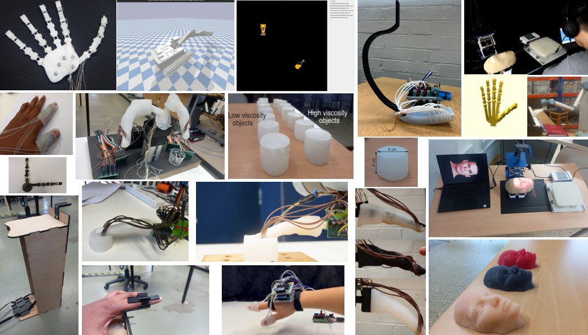

# Recent Research Projects

I study how robots can be used to understand human design, using robotic fine manipulation, information theory, and compliant control. My research sits at the intersection of assistive computing, human–robot interaction, and soft robotics.

## Robot building 
I love building robots! Here are some highlights from the last couple years. These are from projects, human studies and exhibitions.

Among these are robotic fingers, legs, faces, skins and wearables to understand the human design and skills. 

## Simulation work
I am using multi-agent systems (MAS), virtual model control, information theory and machine learning to simulate context-aware models in complex environments.

<video controls>
    <source src="../../assets/images/excavator.webm" type="video/mp4">
</video>

<video controls>
    <source src="../../assets/images/excavator2.mp4" type="video/mp4">
</video>

## Sim to real
We developed compliant robot control that treats humans, objects, and machines uniformly, ensuring safety in complex environments without extensive sensing or simulation. The approach targets construction and factory settings and scales to close human–machine interaction with minimal sensing and high human safety.

<video controls>
    <source src="../../assets/images/VMC.mp4" type="video/mp4">
</video>

<video controls>
    <source src="../../assets/images/VMC1.mp4" type="video/mp4">
</video>

