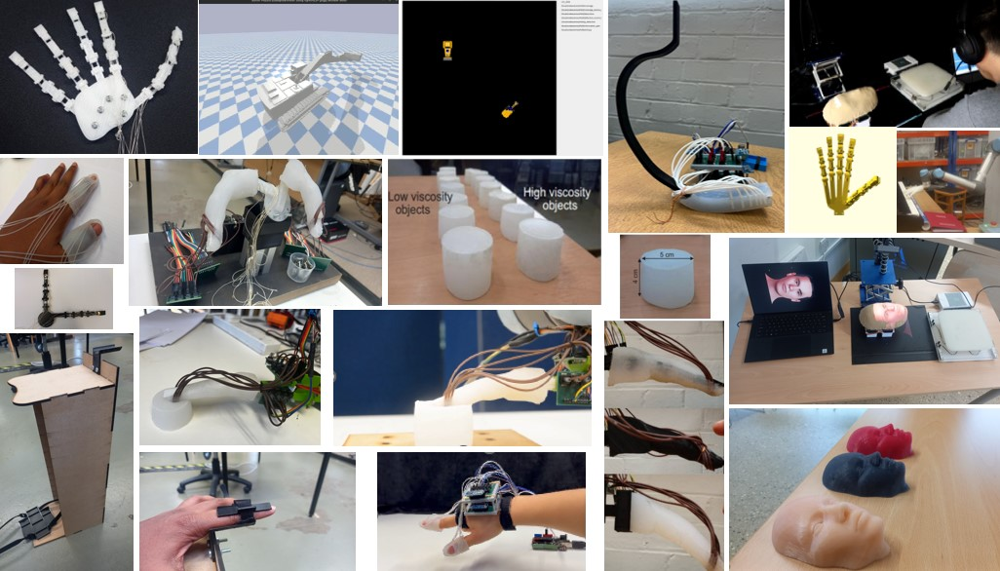

# Projects

### Soft manipulation
The exceptional dexterity, adaptability, and sensory feedback of human and primate hands serve as a gold standard for developing soft robotic hands, inspiring designs that aim to replicate nuanced movements, grip versatility, and tactile precision for complex tasks.

### Simulation work
I am using multi-agent systems (MAS), information theory and machine learning to simulate context-aware models in complex environments.

### Robot building 
I love building robots! Here are some designs I developed for robots, human studies and exhibitions during the last two years.

